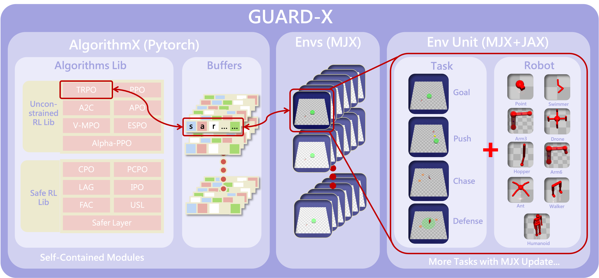
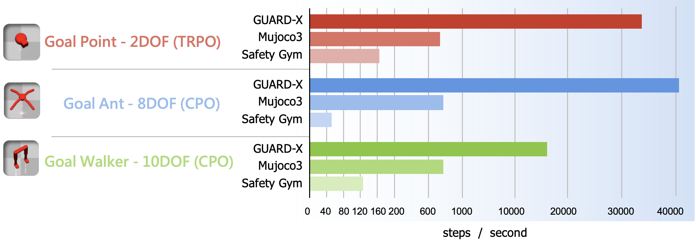

# GUARD: **G**eneralized **U**nified S**A**fe **R**einforcement Learning **D**evelopment Benchmark

Paper link: [GUARD: A Safe Reinforcement Learning Benchmark](https://arxiv.org/abs/2305.13681)

GUARD is a highly customizable generalized benchmark with a wide variety of RL agents, tasks, and safety constraint specifications.
GUARD comprehensively covers state-of-the-art safe RL algorithms with self-contained implementations. 

GUARD is composed of two main components: GUARD Safe RL library and GUARD testing suite.
Our implementation is partially inspired by [safety-gym](https://github.com/openai/safety-gym) and [spinningup](https://github.com/openai/spinningup).

Supported algorithms in the GUARD Safe RL library include:

**Unconstrained**
- [Trust Region Policy Optimization (TRPO)](https://arxiv.org/abs/1502.05477)

**End-to-end**
- [Constrained Policy Optimization (CPO)](https://arxiv.org/abs/1705.10528)
- [TRPO-Lagrangian](https://arxiv.org/abs/1902.04623)
- [TRPO-Feasible Actor Critic (FAC)](https://arxiv.org/abs/2105.10682)
- [TRPO-Interior-point Policy Optimization (IPO)](https://arxiv.org/abs/1910.09615)
- [Projection-based Constrained Policy Optimization (PCPO)](https://arxiv.org/abs/2010.03152)
- [Primal-Dual Optimization (PDO)](https://arxiv.org/abs/1512.01629) (not in paper)
- [State-wise Constrained Policy Optimization (SCPO)] (not in paper)
  - To download SCPO code, run `git submodule update --init --recursive` after cloning this repo.

**Hierarchical**
- [TRPO-Safety Layer (SL)](https://arxiv.org/abs/1801.08757)
- [TRPO-Unrolling Safety Layer (USL)](https://arxiv.org/abs/2206.08528)
- [Lyapunov-based Safe Policy Optimization (LPG)](https://arxiv.org/abs/1901.10031) (not in paper)

GUARD testing suite supports the following agents:
- Swimmer
- Ant
- Walker
- Humanoid
- Hopper
- Arm3
- Arm6
- Drone

GUARD testing suite supports the following tasks:
- Goal


- Push


- Chase


- Defense


GUARD testing suite supports the following safety constraints (obstacles):
- 3D Hazards
- Ghosts
- 3D Ghosts
- Vases
- Pillars
- Buttons
- Gremlins

Obstacles can be either trespassable/untrespassable, immovable/passively movable/actively movable, and pertained to 2D/3D spaces.
For full options, please see the paper.

---
## Installation
Install environment:
```
conda create --name venv python=3.8
conda activate venv
pip install -r requirements.txt

```

Lastly, install `safe_rl_envs` by:

```
cd safe_rl_envs
pip install -e .
```


---
## Quick Start
### 1. Environment Configuration
A set of pre-configured environments can be found in  `safe_rl_env_config.py`. Our traning process will automatically create the pre-configured environments with `--task <env name>`. 

For a complete list of pre-configured environments, see below.

To create a custom environment using the GUARD Safe RL engine, update the `safe_rl_env_config.py` with custom configurations. For example, to build an environment with a drone robot, the chase task, two dynamic targets, some 3D ghosts,  with constraints on entering the 3D ghosts areas. Add the following configuration to `safe_rl_env_config.py`:

```python
if task == "Custom_Env":
  config = {
              # robot setting
              'robot_base': 'xmls/drone.xml',  

              # task setting
              'task': 'defense',
              'goal_3D': True,
              'goal_z_range': [0.5,1.5],
              'goal_size': 0.5,
              'defense_range': 2.5,

              # observation setting
              'observe_robber3Ds': True,
              'observe_ghost3Ds': True, 
              'sensors_obs': ['accelerometer', 'velocimeter', 'gyro', 'magnetometer',
                              'touch_p1a', 'touch_p1b', 'touch_p2a', 'touch_p2b',
                              'touch_p3a', 'touch_p3b', 'touch_p4a', 'touch_p4b'],
              
              # constraint setting
              'constrain_ghost3Ds': True, 
              'constrain_indicator': False, 

              # lidar setting
              'lidar_num_bins': 10,
              'lidar_num_bins3D': 6,
              
              # object setting
              'ghost3Ds_num': 8,
              'ghost3Ds_size': 0.3,
              'ghost3Ds_travel':2.5,
              'ghost3Ds_safe_dist': 1.5,
              'ghost3Ds_z_range': [0.5, 1.5],
              'robber3Ds_num': 2,
              'robber3Ds_size': 0.3,
              'robber3Ds_z_range': [0.5, 1.5],
          }
```
The custom environment can then be  used with `--task Custom_Env` in the training process below.
### 2. Benchmark Suite

An environment in the GUARD Safe RL suite is formed as a combination of a task(one of `Goal`, `Push`, `Chase` or `Defense`), a robot (one of `Point`, `Swimmer`, `Ant`, `Walker`, `Humanoid`, `Hopper`, `Arm3`, `Arm6` or `Drone`), and a type of constraints (one of `8Hazards` and `8Ghosts`, `8` is the number of constraints). Environments include:

* `Goal_{Robot}_8Hazards`: A robot must navigate to a goal while avoiding hazards.
* `Goal_{Robot}_8Ghosts`: A robot must navigate to a goal while avoiding ghosts.
* `Push_{Robot}_8Hazards`: A robot must push a box to a goal while avoiding hazards.
* `Push_{Robot}_8Ghosts`: A robot must push a box to a goal while avoiding ghosts.
* `Chase_{Robot}_8Hazards`: A robot must chase two dynamic targets while avoiding hazards.
* `Chase_{Robot}_8Ghosts`: A robot must chase two dynamic targets while avoiding ghosts.
* `Defense_{Robot}_8Hazards`: A robot must prevent two dynamic targets from entering a protected circle area while avoiding hazards.
* `Defense_{Robot}_8Ghosts`: A robot must prevent two dynamic targets from entering a protected circle area while avoiding ghosts.

(To make one of the above, make sure to substitute `Point`, `Swimmer`, `Ant`, `Walker`, `Humanoid`, `Hopper`, `Arm3`, `Arm6` or `Drone`.)


### 3. Training
Take CPO training for example:
```
cd safe_rl_lib/cpo
conda activate venv
python cpo.py --task Goal_Point_8Hazards --seed 1
```
Training logs (e.g., config, model) will be saved under `<algo>/logs/` (in the above example `cpo/logs/`).

#### Train with Other Environments

You can easily change the algorithm runtime environment to another environment library that **supports the gym interface** by following these steps：

- Add necessary paramaters for build external environment to parameter `arg` in main. (Optional) 
- Import the desired environment and initialize it in `create_env` function.

### 4. Viualization
To test a trained RL agent on a task and save the video:
```
python cpo_video.py --model_path logs/<exp name>/<exp name>_s<seed>/pyt_save/model.pt --task <env name> --video_name <video name> --max_epoch <max epoch>            
```
To plot training statistics (e.g., reward, cost), copy the all desired log folders to `comparison/` and then run the plot script as follows:
```
cd safe_rl_lib
mkdir comparison
cp -r <algo>/logs/<exp name> comparison/
python utils/plot.py comparison/ --title <title name> --reward --cost
```

\<title name\> can be anything that describes the current comparison (e.g., "all end-to-end methods").

---
## Build on top of GUARD

### Introduction to the structure of Engine
The Engine class serves as the core of the GUARD environment and is defined in `safe_rl_envs/safe_rl_envs/envs/engine.py`. The main sections of the Engine class are described below.
```python
class Engine(gym.Env):

    # Default configuration
    DEFAULT = {
    }
    
    #----------------------------------------------------------------
    # Property Functions
    # 
    # Wrappers to extract attributes, such as object positions, 
    # from simulation data.
    #----------------------------------------------------------------
    
    #----------------------------------------------------------------
    # Gym API
    # 
    # General Gym API including step(), reset() and render()
    # https://gymnasium.farama.org/api/env/
    #----------------------------------------------------------------
    
    #----------------------------------------------------------------
    # Environment Configuration Functions
    #
    # Functions for constructing a new environment using build():
    # 1. Construct dictionaries of all objects, including:
    #    - build_placements_dict()
    #    - placements_dict_from_object()
    #    - build_mocap_dict()
    #    - build_world_config()
    # 2. Sample a feasible layout to reset the environment, including:
    #    - build_layout()
    #    - draw_placement()
    #    - constrain_placement()
    #    - sample_layout()
    #    - placements_from_location()
    # 3. Sample feasible goal positions to reset the environment, including:
    #    - build_goal()
    #    - build_goal_button()
    #    - build_goal_position()
    #    - sample_goal_position()
    #----------------------------------------------------------------
    
    #----------------------------------------------------------------
    # Environment Update Functions
    # 
    # Functions for inner updates of the environment:
    # 1. Update mocap objects based on their dynamics, including:
    #    - set_mocaps()
    #    - set_mocap_pos()
    #    - set_mocaps_ghosts()
    #    - set_mocaps_ghost3Ds()
    #    - set_mocaps_robbers()
    #    - set_mocaps_robber3Ds()
    #    - update_layout()
    # 2. Update the button timer:
    #    - buttons_timer_tick()
    #----------------------------------------------------------------

    #----------------------------------------------------------------
    # Observation, Reward, and Cost Functions
    #   
    # 1. Functions to obtain information from the environment, including:
    #    - obs()
    #    - reward() 
    #    - cost()
    # 2. Helper functions for obtaining observations, including:
    #    - obs_compass()
    #    - obs_vision()
    #    - obs_lidar()
    #    - obs_lidar3D()
    #    - obs_lidar_pseudo()
    #    - obs_lidar_pseudo3D()  
    #----------------------------------------------------------------

    #----------------------------------------------------------------
    # Computation Auxiliary Functions
    #
    # This section contains helper functions for calculating distances
    # between objects in the environment. 
    # Users can also add their own custom functions here if needed.
    #----------------------------------------------------------------

    #----------------------------------------------------------------
    # Render Functions
    # 
    # Helper functions for the render() function.
    #----------------------------------------------------------------
```

### An example of defining a customized task using the Engine

For a clearer understanding of the Engine's structure, we provide an illustrative example. Let's define a new task named "`CollectVase`" In this task, the robot's objective is to relocate vases (small box objects) towards the center point while ensuring robot itself remains within a specified circular area around the center point. Achieving this goal involves incorporating two code snippets into the `reward()` and `cost()` functions.
```python
class Engine(gym.Env, gym.utils.EzPickle):

    # Default configuration
    DEFAULT = {
        'task': 'CollectVase',
        'position_limit': 2.0,
        'constrain_position': True,
        'robot_base': 'xmls/myRobot.xml',
    }
    
    #----------------------------------------------------------------
    # Property Functions
    #----------------------------------------------------------------
    
    #----------------------------------------------------------------
    # Gym API
    #----------------------------------------------------------------
    
    def reset(self):
        ''' Integrate the provided code below into the original implementation '''
        self.last_vase_dist = None
    
    #----------------------------------------------------------------
    # Environment Configuration Functions
    #----------------------------------------------------------------
    
    #----------------------------------------------------------------
    # Environment Update Functions
    #----------------------------------------------------------------

    #----------------------------------------------------------------
    # observation, reward and cost functions
    #----------------------------------------------------------------

    def reward(self):
        reward = 0.0
        ''' Integrate the provided code below into the original implementation '''
        if self.task == "CollectVase" and self.last_vase_dist:
            vase_dist = self.average_vase_dist()
            reward += self.last_vase_dist - vase_dist
            self.last_vase_dist = vase_dist
    
    def cost(self):
        cost = {}
        ''' Integrate the provided code below into the original implementation '''
        if self.constrain_position:
            robot_com = self.world.robot_com()
            x, y, _ = robot_com
            radius = np.sqrt(x**2 + y**2)
            cost['position'] = 0
            if radius > self.position_limit:
                cost['position'] = radius - self.position_limit

    #----------------------------------------------------------------
    # Computation Auxiliary Functions
    #----------------------------------------------------------------
    
    def average_vase_dist(self):
        ''' Calculate the mean distance from every vase to the origin point '''
        pass
    
    #----------------------------------------------------------------
    # Render Functions
    #----------------------------------------------------------------

```

### Template for defining a customized robot with xml format.
Consult the template below if you intend to define a new robot. Ensure that the name of the robot body is set to "robot" for compatibility with GUARD.
```xml
<!-- for detailed information, please consult the Mujoco XML reference at 
https://mujoco.readthedocs.io/en/stable/XMLreference.html  -->
<mujoco>
    <worldbody>
        <geom name="floor" size="5 5 0.1" type="plane" condim="6"/>
        <body name="robot" pos="0 0 .1">
            <!-- Define your robot here 
            A robot can be constructed using a series of items, including:
                - Geom: [Geom Reference](https://mujoco.readthedocs.io/en/stable/XMLreference.html#body-geom)
                - Joint: [Joint Reference](https://mujoco.readthedocs.io/en/stable/XMLreference.html#body-joint)
                - Site: [Site Reference](https://mujoco.readthedocs.io/en/stable/XMLreference.html#body-site)
                
            A robot body can also be constructed from sub-bodies:
                - Body: [Body Reference](https://mujoco.readthedocs.io/en/stable/XMLreference.html#body)
            -->
        </body>
    </worldbody>
    <sensor>
        <!-- Define your sensors here 
        Sensors are crucial for capturing the state of the environment from the perspective of robots. Common sensors include:
            - Accelerometer: [Accelerometer Reference](https://mujoco.readthedocs.io/en/stable/XMLreference.html#sensor-accelerometer)
            - Velocimeter: [Velocimeter Reference](https://mujoco.readthedocs.io/en/stable/XMLreference.html#sensor-velocimeter)
            - Gyro: [Gyro Reference](https://mujoco.readthedocs.io/en/stable/XMLreference.html#sensor-gyro)
            - Touch Sensor: [Touch Sensor Reference](https://mujoco.readthedocs.io/en/stable/XMLreference.html#sensor-touch)
            - Joint Position Sensor: [Joint Position Sensor Reference](https://mujoco.readthedocs.io/en/stable/XMLreference.html#sensor-jointpos)
            - Joint Velocity Sensor: [Joint Velocity Sensor Reference](https://mujoco.readthedocs.io/en/stable/XMLreference.html#sensor-jointvel)

        For more sensors, please refer to: [Sensor Reference](https://mujoco.readthedocs.io/en/stable/XMLreference.html#sensor)
        -->

        <!-- Used for intrinsic constraints -->
        <subtreecom body="robot" name="subtreecom"/>
        <subtreelinvel body="robot" name="subtreelinvel"/>
        <subtreeangmom body="robot" name="subtreeangmom"/>
    </sensor>
    <actuator>
        <!-- Define your actuator here
        Actuators are essential for moving the joints of a robot based on actions. Commonly used actuators include:
            - General Actuator: [General Actuator Reference](https://mujoco.readthedocs.io/en/stable/XMLreference.html#actuator-general)
            - Motor Actuator: [Motor Actuator Reference](https://mujoco.readthedocs.io/en/stable/XMLreference.html#actuator-motor)
            - Position Actuator: [Position Actuator Reference](https://mujoco.readthedocs.io/en/stable/XMLreference.html#actuator-position)
            - Velocity Actuator: [Velocity Actuator Reference](https://mujoco.readthedocs.io/en/stable/XMLreference.html#actuator-velocity)

        For more actuators, please refer to: [Actuator Reference](https://mujoco.readthedocs.io/en/stable/XMLreference.html#actuator)
        -->
    </actuator>
</mujoco>

```
### Introduction to the structure of the safe RL library

All RL methods are situated in `safe_rl_lib/`. Each method, denoted as `algo` below, comprises two essential components:

1. **`algo_core.py`**: Defines the structures of all policy networks, directly callable in `algo.py`. Users can craft their custom RL policy structures within this core script.

2. **`algo.py`**: Encompasses the main training pipeline of the algorithm. The key components are introduced as follows:

```python
import algo_core as core

#----------------------------------------------------------------
class AlgoBuffer:
    '''
        Data buffer for storing all training data, including:
        - Observation
        - Action
        - Advantage
        - Reward
        - Value
        - Other data needed by the algorithm
    '''
#----------------------------------------------------------------


#----------------------------------------------------------------
# Computation Auxiliary Functions
# 
# Functions utilized by the algorithms to calculate intermediate variables
#----------------------------------------------------------------


#----------------------------------------------------------------
def algo(env_fn):
    '''
        The central part of the algorithm for training and data collection.
        Takes the environment and all training parameters as input.
    '''
    #----------------------------------------------------------------
    # Loss Functions
    # 
    # Functions for defining loss during training. 
    # Add your own custom loss functions here if needed.
    #----------------------------------------------------------------

    #----------------------------------------------------------------
    def update(self):
        '''
            Update function called at the end of each training epoch.
            Define your own update rule here if needed.
        '''
    #----------------------------------------------------------------
    
    #----------------------------------------------------------------
    # Training Loop
    # 
    # Core training loop comprising the following steps:
    #   1. Interaction between the RL policy defined in the core and the environment.
    #   2. Collection of data from the environment, stored in AlgoBuffer.
    #   3. Execution of the update() function with the collected data.
    #----------------------------------------------------------------     

#----------------------------------------------------------------


#----------------------------------------------------------------  
def create_env(args):
    '''
        Construct the environment based on the user-defined configuration.
    '''
#----------------------------------------------------------------


#----------------------------------------------------------------
if __name__ == '__main__':
    '''
        Main function:

        1. Retrieve arguments from user input.
        2. Invoke the algo() function to initiate the training process.
    '''
#----------------------------------------------------------------
```
 

---
## Contributing to GUARD

Welcome to GUARD! We appreciate your interest in contributing to this project. Whether you want to report a bug, suggest a feature, or contribute code, please follow the guidelines outlined below.

### 1. Issues and Bugs

If you encounter any issues or find a bug, please open an issue on the [issue tracker](https://github.com/intelligent-control-lab/guard/issues). When reporting a bug, include a detailed description, steps to reproduce, and your system configuration.

### 2. Feature Requests

If you have a feature request, please open an issue on the [issue tracker](https://github.com/intelligent-control-lab/guard/issues). Clearly describe the new feature you'd like to see and why it would be valuable.

### 3. Pull Requests

We welcome contributions! If you'd like to contribute code, follow these steps:

1. Fork the repository and create a new branch.
2. Make your changes and test them thoroughly.
3. Ensure your code follows the existing code style and conventions.
4. Write clear and concise commit messages explaining your changes.
5. Open a pull request, linking to any relevant issues and providing a detailed description of your changes.

### 4. Coding Guidelines and Style of Conventions

- Follow the [coding style guide](CODE_OF_CONDUCT.md) of the project.
- Adhere to [PEP 8 style guidelines](https://peps.python.org/pep-0008/) for Python code.
- Use descriptive variable and function names. For example, (i) ```mlp``` stands for ```Multilayer Perceptron```, (ii) ```_d_kl()``` stands for ```KL Divergence computation function```.
- Add comments to explain complex function using the following formats.
```python
def func1(arg1, arg2)
    """
    Introduction of this function.
    Additional detailed description.
    """
```

```python
def func2(arg1, arg2)
    '''Description of this function'''
```
- Write clear and concise commit messages.


### 5. Code Reviews
- All pull requests will be reviewed by project maintainers.
- Be prepared to address any feedback or questions from reviewers.

### 6. Additional Tips
- Before starting work on a major feature, discuss it with the maintainers first to ensure it aligns with the project's goals.
- Break down large changes into smaller, more manageable pull requests.
- Be patient and respectful during the code review process.
- Thank you for your interest in contributing to GUARD!


---
## Maintaining and Expanding GUARD

To ensure the long-term maintenance and growth of this code repository, we have outlined the following plan:

### 1. Maintenance

**Regular Updates:**
We are committed to keeping GUARD up-to-date with the latest advancements in (i) [Mujoco Simulation Engine](https://mujoco.readthedocs.io/en/stable/overview.html); (ii) [Pytorch Toolbox](https://pytorch.org/) and addressing any potential issues. Regular updates will include bug fixes, feature improvements, and compatibility with new dependencies.

**Responsive Issue Management:**
We encourage users to submit issues for bugs, feature requests, or general feedback. Our team will actively monitor the [issue tracker](https://github.com/intelligent-control-lab/guard/issues) and respond promptly to address reported problems or discuss proposed enhancements.


### 2. Expansion

**Realistic Robot Options:**
With the upgraded Mujoco3 Engine, we aim to add a variety of [realistic robot options](https://mujoco.readthedocs.io/en/stable/models.html) for both moving and manipulating robots. This improvement will enable realistic simulations, paving the way for safe real-world robot experiments through simulation-to-reality transfer.

**Unconstrained RL and Safe RL Library:** 
To ensure that the GUARD algorithm library remains aligned with the latest advancements in safe RL algorithms, our objective is to expand its inclusion of more on-policy unconstrained RL and safe RL capabilities. This expansion aims to position the GUARD algorithm library as a comprehensive research platform catering to both the safe RL and unconstrained RL communities. The planned implementations encompass the following algorithms:
- ***Unconstrained RL:***
  - [Absolute Policy Optimization (APO)](https://arxiv.org/pdf/2310.13230.pdf) 
  - [Proximal Policy Optimization (PPO)](https://arxiv.org/abs/1707.06347)
  - [Asynchronous Actor-critic (A2C)](https://arxiv.org/abs/1602.01783?context=cs.LG)
  - [V-MPO](https://arxiv.org/abs/1909.12238)
  - [ESPO](https://arxiv.org/abs/2202.00079)
  - [Alpha-PPO](https://www.sciencedirect.com/science/article/pii/S0925231223001467)

- ***End-to-End Safe RL:***
  - [Primal-Dual Optimization (PDO)](https://arxiv.org/abs/1512.01629)
  - [First Order Constrained Optimization in Policy Space (FOCOPS) ](https://arxiv.org/pdf/2002.06506.pdf)


- ***Hierarchical Safe RL:***
  - [Lyapunov-based Safe Policy Optimization (LPG)](https://arxiv.org/abs/1901.10031)
  - [Uncertainty-Aware Implicit Safe Set Algorithm (UAISSA)](https://arxiv.org/abs/2210.01041)
  - [Neural Barrier Certificate (TRPO-Barrier)](https://ieeexplore.ieee.org/abstract/document/10023989) 


**GUARD-X: The GPU accelerated GUARD**
 Leveraging the latest [Mujoco XLA](https://mujoco.readthedocs.io/en/stable/mjx.html), we can significantly enhances GUARD training efficiency through parallel simulation on GPU. We plan to create a GPU accelerated The updated version, called GUARD-X, maintains synchronization with Mujoco Mjx, ensuring continual compatibility and performance enhancements. Here is the overall structure of GUARD-X 
 
 
The configurable tasks from GUARD will be seamlessly integrated into GUARD-X. With GUARD-X, the computational efficiency of RL training is substantially accelerated, surpassing Safety Gym by hundreds of times. 


### 3. Expansion Timeline


**Planned Expansion Timeline**

| Task               | Start Date | End Date   | Status          |
|--------------------|------------|------------|-----------------|
| Realistic Robot Options          | 2024-01-10 | 2024-03-15 | In Progress     |
| Expanded Unconstrained and Constrained RL Library    | 2024-01-14 | 2024-04-01 | In Progress    |
| GUARD-X        | 2023-12-15 | 2024-04-01 | In Progress         |

**Note:** These timelines are tentative and subject to change based on available resources and community feedback.

### 4. Feedback and Suggestions

We welcome feedback and suggestions on how we can improve this maintenance and expansion plan. Feel free to open an issue to share your thoughts and ideas.


---
## Citing GUARD
```
@article{zhao2023guard,
  title={GUARD: A Safe Reinforcement Learning Benchmark},
  author={Zhao, Weiye and Chen, Rui and Sun, Yifan and Li, Feihan and Liu, Ruixuan and Wei, Tianhao and Liu, Changliu},
  journal={arXiv preprint arXiv:2305.13681},
  year={2023}
}
```

